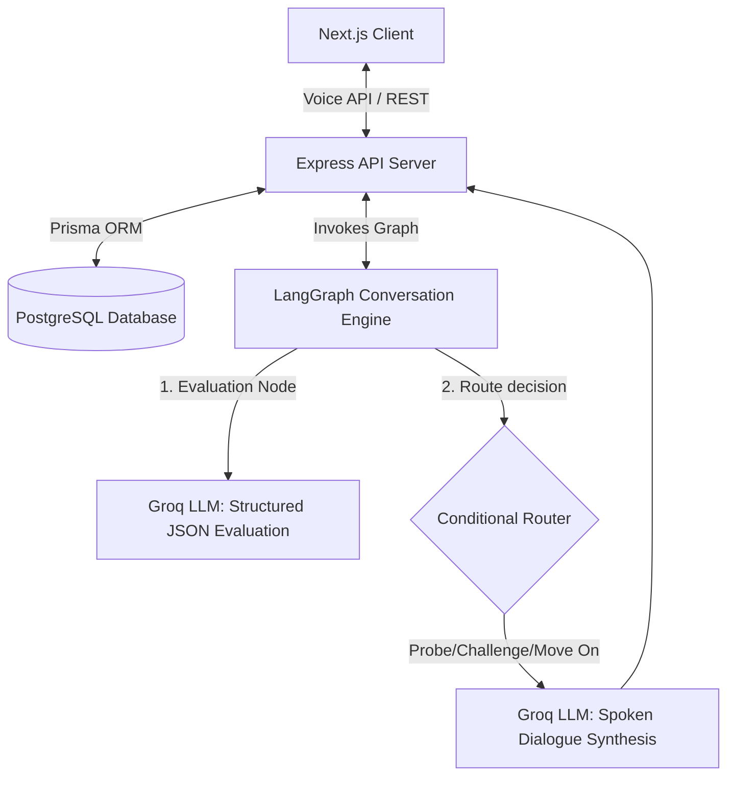
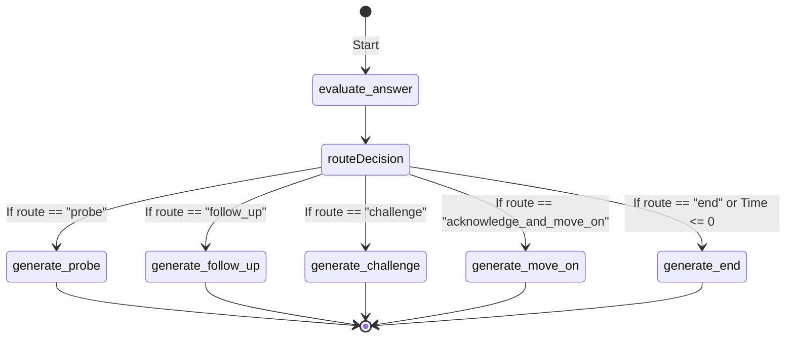

# InterviewAI: Voice-First Mock Interview Platform

Built as part of Mentorque's AI Engineer assignment, InterviewAI is a production-grade, voice-first simulated technical interview platform. Rather than simulating a simple text chat, the system mirrors a live technical assessment. Claire, the AI interviewer, evaluates the depth and specificity of the candidate's answers in real time, tracks state across multiple topics, and dynamically generates contextual follow-up questions.

---

## Project Overview

InterviewAI is engineered to replicate the dynamic, adaptive nature of an interview conducted by a senior engineer. The system dynamically decides whether to probe shallow answers, challenge contradictions with earlier responses, acknowledge strong answers, or transition to new technical domains. 

The interaction is completely voice-first, driven by modern Web Speech synthesis/recognition APIs and voice endpointing configurations. Behind the scenes, a custom state machine orchestrated via LangGraph manages the decision flow, and a Groq-powered LLM handles structured answer evaluation and natural dialog synthesis.

---

## Problem Statement

Standard mock interview tools often feel scripted, linear, and robotic. They typically follow static lists of questions, cannot gauge the completeness of a candidate's answer, and fail to dig deeper when a candidate gives a vague explanation. This leads to unrealistic practice environments that do not adequately prepare engineers for real-world loops where interviewers probe edge cases, push back on assumptions, and check for logical contradictions.

---

## Assignment Objective

The objective of this assignment is to build a robust, real-time AI mock interviewer that:
1. Conducts voice-first, low-latency technical interviews.
2. Models a multi-step interview state (covering JavaScript, React, Node.js, Express.js, PostgreSQL, REST APIs, Authentication, System Design, and Problem Solving).
3. Formulates intelligent decisions based on structured answer evaluation (detecting gaps, depth, specificity, and claims contradictions).
4. Limits consecutive follow-up loops to prevent interrogation cycles.
5. Employs a decoupled architecture where answer evaluation and spoken dialogue synthesis are separated into isolated processing steps.

---

## Features

- **Voice-First Interaction:** Integrated real-time microphone capture and audio synthesis loop with customized pause/resume controls.
- **Dynamic Response Flow:** The AI interviewer evaluates answers and dynamically branches into clarifying, probing, challenging, or transitioning tracks.
- **Topic-by-Topic Progress Tracking:** Evaluates candidate competency across 9 technical topics without looping or repeating covered concepts.
- **Smart Follow-Up Limits:** Enforces a hard cap of 2 consecutive follow-up questions per topic before shifting to another technical module.
- **Contradiction Detection:** Tracks historical factual assertions made by the candidate and challenges logical inconsistencies.
- **Structured Evaluation (Behind-the-Scenes):** Separate evaluation step logs granular JSON details (depth, specificity, gaps, and routing decisions) to the console for observability.
- **Natural Spoken Cadence:** Spoken dialogue is optimized for text-to-speech engine prosody, utilizing natural contractions, varied sentence rhythms, and deliberate punctuation breaks.

---

## System Architecture



The system is split into three main tiers:
1. **Frontend Tier (Next.js):** Manages user state, session creation, timers, web speech recognition/synthesis, and interface feedback.
2. **Backend API Tier (Express.js):** Exposes REST API endpoints for user auth, session initialization, message tracking, and persistence.
3. **AI Reasoning Tier (LangGraph & Groq):** Coordinates the multi-step state graph. Separates judgment (evaluation) from voice rendering (synthesis) to guarantee that conversational actions are mathematically routed.

---

## Core Voice Interview Flow

1. The client registers or logs in via JWT authentication.
2. The user initiates a "Voice Interview" session from the dashboard.
3. The server sets up the session in PostgreSQL and returns the details.
4. Claire greets the candidate and asks the first question.
5. The candidate records their response. Once silence is detected, the client sends the transcript to `/api/interview/message`.
6. The backend runs the LangGraph engine:
   - **evaluate_answer Node:** Compiles current state, evaluates the candidate's last answer, checks claims for contradictions, and selects a route.
   - **State Router:** Directs execution to a specific dialogue generator node based on the evaluation route.
   - **generate_response Node:** Formulates the spoken response using dialogue synthesis prompts.
7. The server updates the database and returns the response.
8. The client synthesizes the response text to audio and opens the microphone for the candidate's next turn.

---

## Tech Stack

### Frontend
- **Next.js (App Router):** Client-side application routing and UI views.
- **Tailwind CSS:** Layout and typography styling.
- **Lucide React:** Icons.
- **Web Speech API:** Web SpeechSynthesis and webkitSpeechRecognition for real-time speech processing.

### Backend
- **Node.js & Express.js:** REST API endpoints.
- **Prisma ORM:** Database interface and schema migrations.

### AI & Reasoning
- **LangGraph (@langchain/langgraph):** State orchestration and routing graphs.
- **Groq SDK (ChatGroq):** Powered by `llama-3.1-8b-instant` for low-latency, high-speed LLM inferences.

### Database & Authentication
- **PostgreSQL:** Persistent storage.
- **JSON Web Tokens (JWT):** Secure session authentication.

---

## Folder Structure

```
InterviewAI/
├── client/
│   ├── src/
│   │   ├── app/                # Next.js App Router (Dashboard, Login, Interview)
│   │   ├── assets/             # Global media assets (profile.png)
│   │   ├── components/
│   │   │   └── interview/      # Interview-specific React Components (VoiceButton, InterviewerCard)
│   │   ├── context/            # Global context providers (AuthContext)
│   │   ├── services/           # Backend HTTP request services
│   │   └── utils/
│   └── package.json
└── server/
    ├── prisma/                 # Prisma DB configuration & schemas
    ├── src/
    │   ├── config/             # System environment configurations
    │   ├── middleware/         # Auth and error handler middlewares
    │   ├── modules/
    │   │   ├── ai/             # LangGraph and Groq service modules
    │   │   ├── auth/           # User authentication routes and controllers
    │   │   ├── interview/      # Session and message controller/repository modules
    │   │   └── voice/          # Vapi call configurations
    │   └── app.js
    └── package.json
```

---

## Database Design

PostgreSQL tables managed through Prisma schema:

### User
Tracks candidate credentials:
- `id` (String, Primary Key)
- `name` (String)
- `email` (String, Unique)
- `password` (String, Hashed)
- `createdAt` (DateTime)
- `updatedAt` (DateTime)

### InterviewSession
Tracks interview instance metadata:
- `id` (String, Primary Key)
- `userId` (String, Foreign Key -> User)
- `status` (Enum: `ACTIVE`, `COMPLETED`)
- `startedAt` (DateTime)
- `endedAt` (DateTime, Nullable)
- `createdAt` (DateTime)

### Message
Tracks the chronological conversation log:
- `id` (String, Primary Key)
- `sessionId` (String, Foreign Key -> InterviewSession)
- `speaker` (Enum: `USER`, `AI`)
- `content` (String, Text)
- `createdAt` (DateTime)

---

## LangGraph Conversation Engine

The conversation state is represented by a structured graph containing the following nodes and routing logic:



### Graph State Schema
```javascript
{
  messages: Array,                    // Running history of messages
  topics_covered: Array,              // List of covered topics and depth reached
  key_claims: Array,                  // Factual technical statements made by candidate
  follow_up_count_by_topic: Object,    // Number of follow-ups asked per topic (capped at 2)
  time_elapsed_minutes: Number,       // Duration of interview so far
  time_remaining_minutes: Number,     // Duration remaining
  evaluation: Object,                 // Current turn evaluation JSON
  response: String                    // Next spoken response text
}
```

---

## AI Decision Flow

### 1. Evaluation Node (`evaluate_answer`)
Analyzes the candidate's last answer and returns a structured JSON payload:
- **Depth:** `"shallow" | "adequate" | "strong"`
- **Specificity:** `"vague" | "concrete"`
- **Gaps:** List of missing technical elements.
- **Contradicts Earlier:** Boolean indicating if their last answer conflicts with a claim stored in `key_claims`.
- **Route:** Selected dialogue path.

### 2. Conversation Router (`routeDecision`)
- Forces transition to `generate_end` if `time_remaining_minutes <= 0` or all allowed topics are completed.
- Enforces follow-up limits: If the current topic already has $\ge 2$ follow-up turns, it overrides the route to `acknowledge_and_move_on` (or `challenge` if a contradiction is present).
- Routes to `generate_challenge` if `contradicts_earlier` is true.
- Directs flow to `generate_probe` or `generate_follow_up` depending on evaluation depth and specificity.

### 3. Generation Nodes (`generate_response`)
Applies specialized system instructions depending on the routed node to synthesize a spoken prompt:
- **Speech Formatting:** Always writes in contractions, varies sentence length, uses commas and ellipses for natural pausing, and avoids markdown or lists.
- **No generic fillers:** Eliminates mechanical openers like "Great answer" in favor of topic callbacks or direct transitions.

---

## API Endpoints

### Authentication
- `POST /api/auth/register` - Registers a new user.
- `POST /api/auth/login` - Authenticates credentials and issues a JWT.
- `GET /api/auth/me` - Resolves the current user context (Authenticated).

### Interview Sessions
- `POST /api/interview/start` - Initializes a new mock interview session (Authenticated).
- `POST /api/interview/message` - Accepts a candidate's voice transcript, updates the database, processes the state graph, and returns Claire's synthesized next turn (Authenticated).
- `POST /api/interview/end` - Explicitly completes and terminates the session (Authenticated).
- `GET /api/interview/history` - Fetches the listing of user sessions (Authenticated).
- `GET /api/interview/:id` - Retrieves detailed logs and transcripts for a session (Authenticated).

---

## Installation & Local Setup

Install dependencies and prepare the system locally in under 5 commands:

```bash
# 1. Install workspace dependencies
npm run install-all

# 2. Configure environment variables (Define DATABASE_URL & GROQ_API_KEY in server/.env)
cp server/.env.example server/.env

# 3. Apply Prisma migrations to set up PostgreSQL schema
cd server && npx prisma migrate dev --name init

# 4. Start the backend development server
npm run dev
```

---

## Environment Variables

### Backend (`server/.env`)
- `PORT`: Port the Express API server runs on (default: `5000`).
- `DATABASE_URL`: Connection string for PostgreSQL instance.
- `JWT_SECRET`: Secret key used for signing JSON Web Tokens.
- `GROQ_API_KEY`: API key for accessing Groq LLM inferences.

### Frontend (`client/.env`)
- `NEXT_PUBLIC_API_URL`: Fully qualified URL pointing to the Express server (default: `http://localhost:5000/api`).

---

## Running the Project

To boot both services concurrently during development, run the following command from the root workspace directory:

```bash
npm run dev
```

This runs:
- The Next.js dev client at `http://localhost:3000`
- The Express API server at `http://localhost:5000`

---

## Future Improvements

- **WebRTC Voice Stream Processing:** Move from Web Speech API's client-side transcription to full server-side WebRTC voice streaming via custom models or Vapi integrations to achieve zero-latency conversational backchanneling.
- **Speech Emotion Analysis:** Integrate voice frequency analysis to evaluate candidate confidence and speech speed metrics.
- **Real-time Code Playground:** Integrate a shared browser IDE enabling candidates to live-code while talking through their problem-solving patterns.

---

## Trade-offs & Design Decisions

### Web Speech API vs. WebRTC Voice Streaming
- **Trade-off:** The Web Speech API runs client-side, making it free and zero-cost, but is browser-dependent (optimally runs on Chrome/Edge) and cannot record/stream raw audio directly to the server.
- **Decision:** Leveraged Web Speech for the frontend client logic to minimize cloud hosting overhead while writing a robust Vapi configuration server-side to support drop-in, zero-latency WebRTC streaming integrations.

### Stateless LLM History vs. DB-Stored Messages
- **Trade-off:** Passing the entire database message history to the LLM on every turn increases token count and processing time.
- **Decision:** State is reconstructed dynamically by evaluating the database history on each turn. This eliminates complex synchronization bugs and ensures the LLM maintains perfect awareness of what has been discussed.

---

## Security Considerations

- **Secure JWT Storage:** Frontend auth stores JWTs securely in the client state and verifies claims before exposing paths.
- **Database Sanitization:** All user query parameters are handled through Prisma client bindings to completely eliminate SQL injection vulnerability.
- **Inbound Validation:** Middleware validates JSON payloads before hitting controllers, protecting server resources from payload floods.

---

## Performance Considerations

- **Low-Latency LLM Inferences:** Using Groq's high-speed Llama-3.1 engine keeps JSON evaluation and speech dialogue generation cycles under ~1.2s.
- **Prisma Connection Pooling:** Configured optimized database connections using PgBouncer connections to Neon PostgreSQL database to prevent connection exhaustion.
- **Pulsing CSS Animations:** Used pure CSS transitions and animation loops for live UI status components, bypassing expensive DOM-redraw cycles.

---

## Screenshots

*(Mock visual layout placeholders for recruiters)*

### 1. Dashboard & History
```
+--------------------------------------------------------+
|  InterviewAI                       Welcome, Candidate  |
+--------------------------------------------------------+
|                                                        |
|   Ready to practice?                                   |
|   [ Start Voice Interview ]                            |
|                                                        |
|   Recent Sessions                                      |
|   #ae34f2   July 3, 2026   COMPLETED   14 messages     |
|   #23bc89   July 2, 2026   COMPLETED   8 messages      |
|                                                        |
+--------------------------------------------------------+
```

### 2. Live Interview Interface
```
+--------------------------------------------------------+
|  InterviewAI                       ⏱️ 08:45  🟢 Live   |
+--------------------------------------------------------+
|  [ Claire Avatar ]      Interview Status: AI Speaking  |
|  AI Interviewer         Claire is asking the question..|
|  Topic: Full Stack     +----------------------------+  |
|                         | Claire: "How do you check  |  |
|  [ Pause Interview ]    | for memory leaks in node?" |  |
|  [ End Interview ]      |                            |  |
|                         | Candidate: (Listening...)  |  |
|                         +----------------------------+  |
|                         |         [ (Mic) ]          |  |
+--------------------------------------------------------+
```

---

## Deployment

### Frontend (Vercel)
The Next.js client is optimized for easy deployment to Vercel by setting `NEXT_PUBLIC_API_URL` to point to the production backend server.

### Backend & DB (Render / Neon)
- Deploy the Express server to Render or Heroku.
- Deploy the PostgreSQL instance to Neon with automatic scaling and connection pooling.
- Run `npx prisma db push` during deployment pipeline steps to sync tables.

---

## License

This project is open-source and available under the [MIT License](LICENSE).